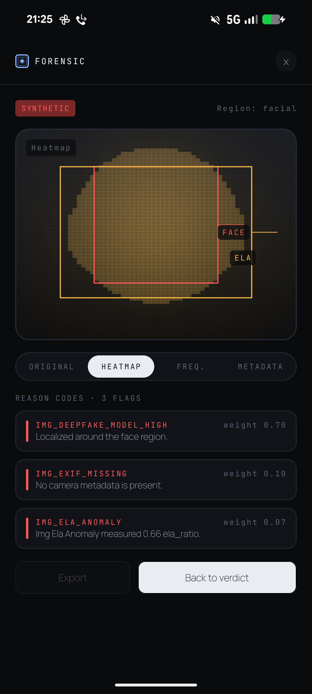
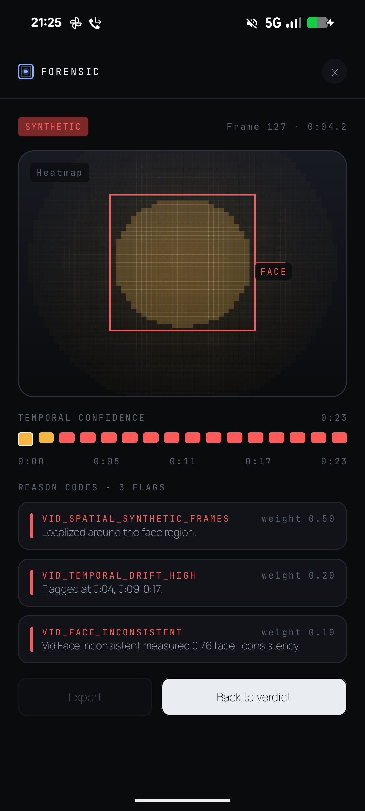
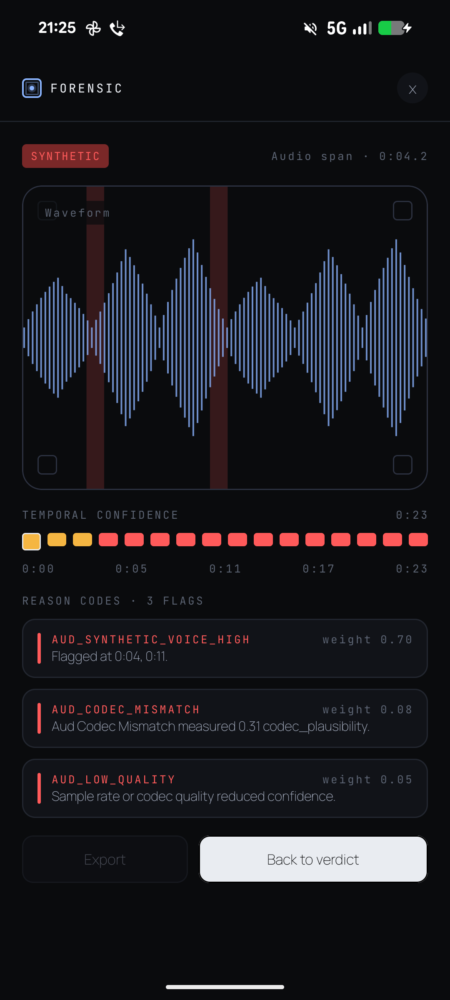
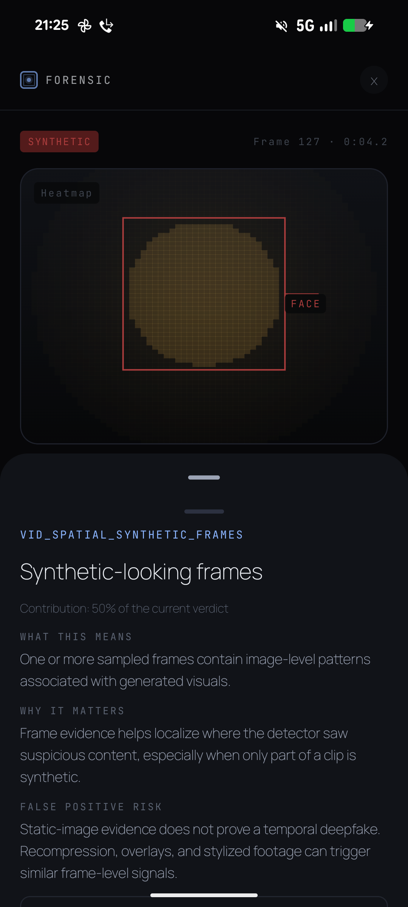
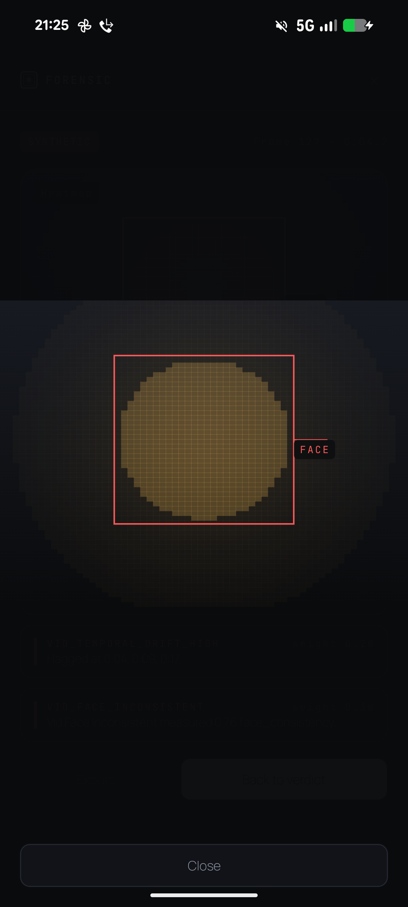

# Phase 10 Completion Report

**Phase:** 10 - Forensic view
**Completed:** 2026-04-26
**Device review:** Pixel 8 (`1080 x 2400`, density `420`)

## Deliverables
- [x] Real forensic evidence contract: heatmap, timeline, waveform, and session-only `ForensicEvidence`.
- [x] Image and video heatmap renderer using reduced-resolution Canvas bins and `BlendMode.Screen`.
- [x] Video/audio temporal timeline with interactive segment scrubbing.
- [x] Audio waveform renderer with highlighted flagged regions.
- [x] Image heatmap overlay path with fullscreen pinch-zoom support.
- [x] Per-reason detail sheet with tappable timestamps that scrub the forensic view.
- [x] Resource-backed reason-code detail templates for current production detector/provenance codes.
- [x] Focused unit tests and a Compose instrumented Phase 10 UI test class.

## Pixel 8 Visual Review
Captured from attached Pixel 8 via `adb shell screencap -p` using the debug Phase 10 forensic harness.

## Reason Code Coverage
Checked the current Phase 7/8/9 production detector reason emissions plus provenance pipeline reason emissions.

- Image detector: `6 / 6` emitted codes have label, explanation, why-it-matters, and false-positive-risk resources.
- Audio detector: `5 / 5` emitted codes have full resources.
- Video detector: `6 / 6` emitted codes have full resources.
- Distinct detector total: `16 / 16` current emitted detector codes covered, with `CODEC_CONSISTENT` shared.
- Provenance pipeline: `7 / 7` emitted provenance codes covered.
- Current production total: `23 / 23` emitted codes covered.
- Gap: `0` for current Phase 7/8/9 detector and provenance emissions.

Legacy/fake-only enum values that are not emitted by the production Phase 7/8/9 detectors still use the resource-backed generic fallback. They are intentionally outside the Phase 10 production coverage count and should get bespoke copy only if reintroduced into a production detector path.

## Acceptance Criteria
- [x] Heatmap renders for video + image variants.
- [x] Timeline is interactive.
- [x] Reason sheet opens and closes.
- [x] Scrubbing works: `selectedTimestampMs` is shared between timeline, reason sheet timestamps, and heatmap frame selection.
- [x] Pixel 8 visual review captured and embedded.
- [ ] Pixel 8 connected Compose assertion pass.

## Connected Test Status
The Phase 10 UI test is written with Compose testing APIs (`createComposeRule`, `onNodeWithTag`, and stable `Modifier.testTag` values). The app module already has Compose UI test dependencies:

- `androidTestImplementation(libs.androidx.compose.ui.test.junit4)`
- `debugImplementation(libs.androidx.compose.ui.test.manifest)`

On the attached Android 16 Pixel 8, the test process fails before app assertions because AndroidX Compose UI test delegates idling through Espresso internally:

`androidx.compose.ui.test.EspressoLink_androidKt.runEspressoOnIdle -> androidx.test.espresso.Espresso.onIdle -> NoSuchMethodException: android.hardware.input.InputManager.getInstance`

This is not an app assertion failure and not a raw Espresso-authored test. It is the AndroidX Compose test runtime hitting Espresso's Android 16 reflection path.

## Decisions Made
- D-056: added session-only `ForensicEvidence` to detector outputs and verdicts.
- D-057: chose `64 x 64` heatmap bins for bounded Canvas rendering.
- D-058: moved current production reason detail copy to `strings.xml` with a resource-backed generic fallback.

## Deviations From Plan
- The current Phase 7/9 detector stack does not expose raw Grad-CAM tensors. Phase 10 adds a typed evidence layer populated from real detector scores, reasons, timestamps, and regions, then renders that layer. This keeps the UI contract real and avoids continuing Phase 5 placeholders, but it is not a raw model-attention export.
- Pixel 8 connected test execution remains blocked by the AndroidX Compose/Espresso Android 16 compatibility issue above. Pixel 8 visual evidence was captured separately with the debug forensic harness.

## Verification
- `$env:JAVA_HOME='C:\Program Files\Java\jdk-21'; .\gradlew.bat :app:compileDebugKotlin`
- `$env:JAVA_HOME='C:\Program Files\Java\jdk-21'; .\gradlew.bat :domain-detection:test :app:testDebugUnitTest :app:compileDebugAndroidTestKotlin`
- `$env:JAVA_HOME='C:\Program Files\Java\jdk-21'; .\gradlew.bat :app:assembleDebug`
- Pixel 8 screenshot capture: `adb shell screencap -p`
- Pixel 8 attempted: `$env:JAVA_HOME='C:\Program Files\Java\jdk-21'; .\gradlew.bat :app:connectedDebugAndroidTest '-Pandroid.testInstrumentationRunnerArguments.class=com.veritas.app.Phase10ForensicUiTest'`

## Ready for Phase 11?
Mostly. Phase 10 implementation, reason-code coverage, and Pixel 8 visual review are complete. The remaining blocker is the connected Compose test runtime compatibility issue on Android 16.
