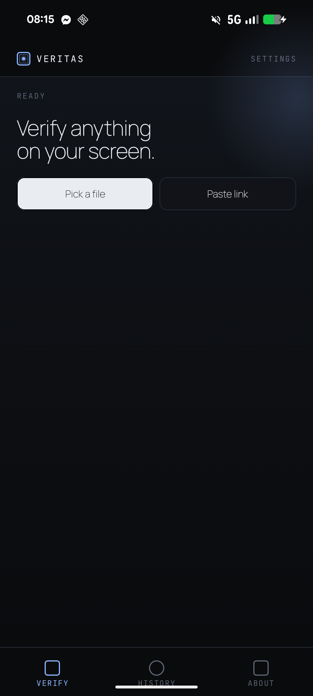
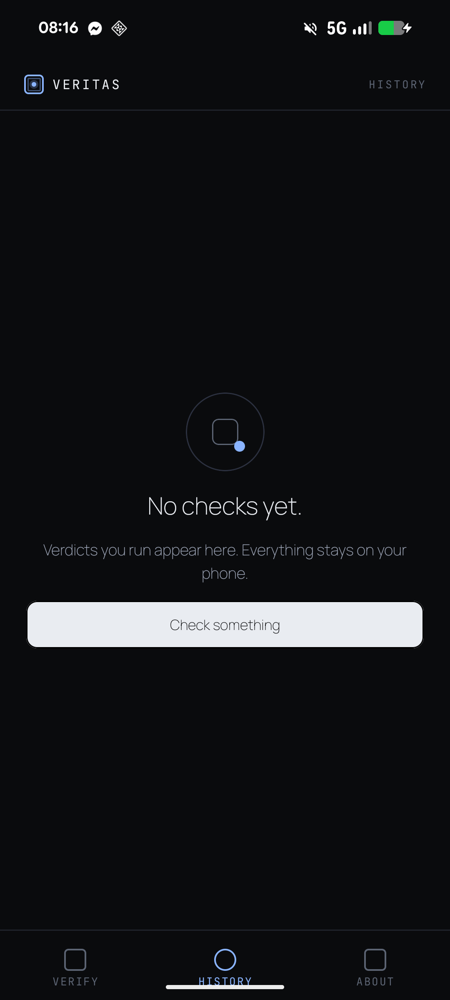
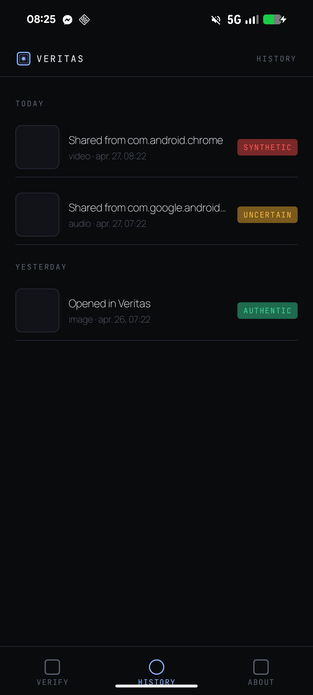
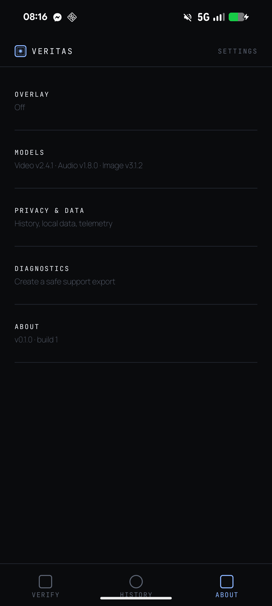
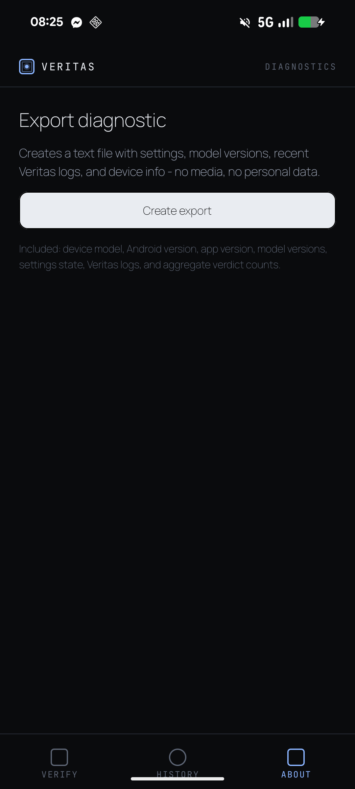
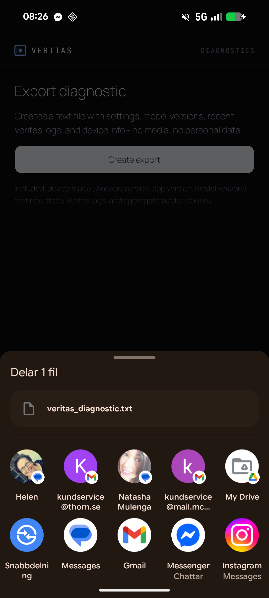

# Phase 11 Completion Report

**Phase:** 11 - History and settings
**Completed:** 2026-04-27
**Device review:** Pixel 8 completed on 2026-04-27

## Deliverables
- [x] Room-backed scan history with latest-100 retention.
- [x] App-private thumbnails generated at verdict time before media purge.
- [x] History list grouped by Today, Yesterday, This week, and Earlier.
- [x] History detail route reusing verdict UI with historical chrome.
- [x] Delete item, clear history, and thumbnail cleanup paths.
- [x] Preferences DataStore-backed settings repository.
- [x] Settings panes for Overlay, Models, Privacy & Data, Diagnostics, and About.
- [x] One-time telemetry opt-in sheet after a scan, defaulting to off.
- [x] Diagnostic export generator and share flow with FileProvider.
- [x] Unit and Compose-test coverage for the new persistence and UI surfaces.
- [x] Phase 11 user-visible history, settings, and telemetry copy moved to `strings.xml`.
- [x] Pixel 8 density review screenshots captured for history, settings, and diagnostic export.

## Privacy Review
- Original media is not stored in history.
- Source media URI/path is not stored in `HistoryItemEntity`.
- History stores only media type, MIME type, source package, bounded app-private thumbnail path, verdict outcome, confidence range, summary, top three reason codes/evidence summaries, model versions, and scan timestamp.
- Forensic heatmaps, waveforms, timelines, C2PA manifests, and raw detector tensors remain session-only.
- Thumbnails are deleted when history rows are deleted, cleared, or pruned beyond 100 items.
- Diagnostic export excludes media files, media paths, source thumbnails, C2PA manifests, source package history, per-scan reason detail text, user identifiers, location, and full logcat.

## Diagnostic Export Contents
Included:
- Device manufacturer/model, Android SDK/release, CPU count, max memory.
- App version name/code.
- Current model version labels.
- Settings state.
- Aggregate verdict counts for the last 30 days.
- Last 50 Veritas-tagged logs with `file://` and `content://` values redacted.

Excluded:
- Original media or copied media.
- Media URIs/paths and thumbnail paths.
- Per-scan reason detail text.
- C2PA manifests and full logcat.
- User account, location, contacts, and identifiers.

## Sample Diagnostic Export
Representative sample generated from the Phase 11 export format:

```text
Veritas diagnostic export
format_version=1

[device]
manufacturer=Google
model=Pixel 8
android_sdk=36
android_release=16
available_processors=8
max_memory_mb=512

[app]
version_name=0.1.0-debug
version_code=1

[models]
video_detector=v2.4.1
audio_detector=v1.8.0
image_detector=v3.1.2

[settings]
overlay_enabled=false
bubble_haptics=true
toast_auto_dismiss_seconds=8
model_auto_update=true
model_wifi_only=true
telemetry_opt_in=false

[verdict_counts_last_30_days]
verified_authentic=0
likely_authentic=1
uncertain=0
likely_synthetic=1

[veritas_logs_last_50]
D/VeritasScan: opened file://[redacted]
D/VeritasShare: provider content://[redacted]
```

## Tests Added
- `HistoryRepositoryTest`: save, latest-100 pruning, summary-only history, thumbnail cleanup on prune/delete/clear.
- `SettingsRepositoryTest`: defaults, telemetry choice persistence, reset behavior.
- `DiagnosticExportGeneratorTest`: export includes operational state and redacts/excludes sensitive values.
- `Phase11HistorySettingsUiTest`: Compose API smoke coverage for history, settings panes, and telemetry modal dismissal.

## Pixel 8 Visual Review
Device:
- Google Pixel 8 (`shiba`)
- Android 16 / SDK 36
- Physical size: 1080x2400
- Physical density: 420

Screenshots captured from the connected Pixel 8 with `adb shell screencap -p`:













Visual issues found and fixed during the Pixel 8 pass:
- The debug app inherited a platform action bar, which pushed/overlapped Compose content. Fixed by applying `Theme.Veritas` with `NoActionBar`.
- Removing the platform action bar exposed missing status-bar insets on the Compose top bars. Fixed with `statusBarsPadding()` on Home, History, and Settings top bars.
- Long source package labels wrapped awkwardly in populated history rows. Fixed with single-line ellipsis on the source and metadata text.

The populated history screenshot uses representative seeded local history rows to exercise image, audio, and video row layout without storing original media.

## Connected Pixel 8 Test
Command:

```powershell
$env:JAVA_HOME='C:\Program Files\Java\jdk-21'
$env:ANDROID_SERIAL='45131FDJH0015H'
.\gradlew.bat :app:connectedDebugAndroidTest '-Pandroid.testInstrumentationRunnerArguments.class=com.veritas.app.Phase11HistorySettingsUiTest'
```

Result:
- The test installed and launched on Pixel 8, then failed before Phase 11 assertions inside AndroidX Compose test idling.
- Failure signature: `java.lang.NoSuchMethodException: android.hardware.input.InputManager.getInstance`
- Stack path: `androidx.compose.ui.test.EspressoLink_androidKt.runEspressoOnIdle` -> `androidx.test.espresso.Espresso.onIdle` -> `InputManagerEventInjectionStrategy.initialize`.

This is the same Android 16 AndroidX Compose/Espresso runtime issue observed in Phase 10. The Phase 11 test itself uses Compose test APIs, but the current Compose test runtime still bridges through Espresso idling on device. JVM tests and Android test compilation remain green.

## Decisions Made
- D-059: History stores thumbnails and verdict summaries only.
- D-060: History thumbnails are generated before purge and pruned with Room rows.
- D-061: Phase 11 settings use one Preferences DataStore.
- D-062: Diagnostic export is aggregate and redacted.

## Verification
- `$env:JAVA_HOME='C:\Program Files\Java\jdk-21'; .\gradlew.bat :app:compileDebugKotlin`
- `$env:JAVA_HOME='C:\Program Files\Java\jdk-21'; .\gradlew.bat :data-detection:testDebugUnitTest :app:testDebugUnitTest :app:compileDebugAndroidTestKotlin`
- `$env:JAVA_HOME='C:\Program Files\Java\jdk-21'; .\gradlew.bat :app:assembleDebug`
